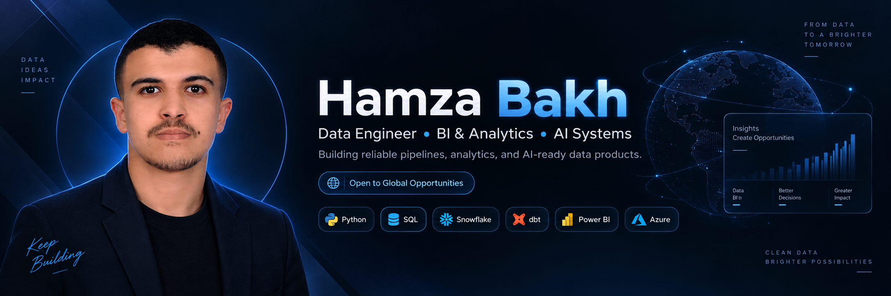
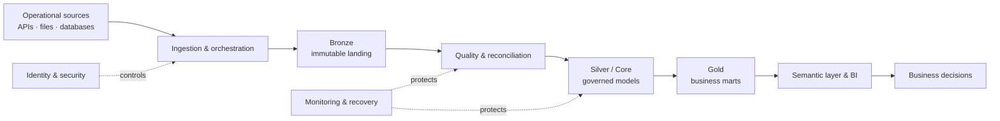

  

  <h1>Hamza Bakh</h1>
  <h3>Data Engineer · Analytics Engineer · BI & Data Infrastructure</h3>

  

    I design reliable data platforms that turn operational data into governed models, 
    trusted metrics and decision-ready analytics.
  

  

    
    
    
  

  
<strong>Open to data engineering, analytics engineering, BI and data-platform opportunities.</strong>

---

## What I deliver

| Data platforms | Analytics products | Data reliability | Infrastructure operations |
|---|---|---|---|
| Batch and event ingestion, ETL/ELT orchestration, layered lakehouse and warehouse design | Dimensional models, semantic metrics, Power BI and Metabase decision products | Data contracts, validation, reconciliation, lineage and quality observability | PostgreSQL and SQL Server labs, monitoring, recovery, identity and secure messaging controls |

My work follows one operating principle: **a pipeline is not complete until its data is trusted, its failures are observable, and its output supports a real decision.**

## Engineering architecture

## Selected work

| Project | Business and engineering outcome | Evidence |
|---|---|---|
| [Automated Validation Framework](https://github.com/Hamzabakh1/python-automated-validation-framework) | Reusable Python controls for schema, completeness, uniqueness and reconciliation checks | Executable validation modules and repeatable checks |
| [Multi-Tenant Data Warehouse](https://github.com/Hamzabakh1/multi-tenant-data-warehouse-saas-bi) | Tenant-isolated ingestion, warehouse modeling and embedded BI architecture | Data architecture case study |
| [ETL + Metabase Analytics](https://github.com/Hamzabakh1/PRJ_ETL_METABASE_PFE1) | Delivers a Python ETL workflow and analytics-ready tables for operational reporting | Implemented transformations and Metabase delivery structure |
| [Finora Financial Intelligence](https://github.com/Hamzabakh1/finora-financial-intelligence) | Finance-oriented platform blueprint with regional policy packs and executive analytics | Product and system architecture case study |
| [IRON CORE OS](https://github.com/Hamzabakh1/iron-core-os) | Connects projects, tasks, skills, KPIs and work sessions in a local-first execution system | Working application prototype and linked operating model |
| [Courtline](https://github.com/Hamzabakh1/courtline-padel-community) | Mobile-first padel matchmaking and community experience | Interactive front-end prototype |

## Private enterprise labs

These focused environments are maintained privately because they model administrative and infrastructure controls. Architecture, code walkthroughs and redacted execution evidence are available during technical discussions.

- **Enterprise Data & Infrastructure Lab** — identity decisions, data-quality gates, PostgreSQL, safe messaging, Prometheus monitoring, analytics controls and disaster recovery.
- **Azure Real Estate Data Platform** — Azure Data Factory orchestration, Bronze/Silver/Gold contracts, Azure SQL marts and Power BI delivery.
- **SQL Server Performance Clinic** — Query Store, workload baselining, targeted indexes, blocking diagnostics and before/after evidence.
- **PostgreSQL HA & PITR Lab** — replication design, WAL archiving, backup verification and point-in-time recovery procedures.
- **Database Infrastructure Observability** — exporters, Prometheus, Alertmanager, Grafana dashboards and controlled failure drills.
- **Identity Lifecycle Automation** — deterministic joiner/mover/leaver plans, access convergence, protected offboarding and audit trails.
- **Active Directory & Secure Mail Labs** — directory topology, policy validation, mail authentication, transport controls and incident runbooks.

## Technical toolkit

  
  
  
  
  
  
  
  
  
  
  
  

| Discipline | Tools and methods |
|---|---|
| Data engineering | Python, SQL, Azure Data Factory, ETL/ELT, APIs, orchestration and Docker |
| Analytics engineering | Dimensional modeling, dbt-style transformations, tests, documentation and semantic layers |
| Data architecture | Bronze/Silver/Gold, warehouse and lakehouse patterns, contracts, lineage and governance |
| BI engineering | Power BI, DAX, Power Query, Metabase, KPI design and finance analytics |
| Database reliability | PostgreSQL, SQL Server, Query Store, backup/recovery, performance and observability |
| Automation and controls | PowerShell, lifecycle workflows, CI, configuration validation and runbooks |

## How I work

1. Start with the user, operational problem and measurable acceptance criteria.
2. Define source contracts, ownership and security boundaries before implementation.
3. Keep raw, cleaned, core and consumption layers explicit.
4. Build quality, reconciliation and observability into the delivery path.
5. Test failure and recovery—not only the happy path.
6. Separate implemented capabilities from simulated or planned extensions.

## Current direction

- Production-grade data engineering and analytics engineering.
- Azure, SQL, orchestration, dimensional modeling and semantic governance.
- Database reliability, data observability and recoverable infrastructure.
- Clear technical communication for business, BI and platform stakeholders.

## Contact

- [LinkedIn — Hamza Bakh](https://www.linkedin.com/in/hamza-bakh/)
- [GitHub — Hamzabakh1](https://github.com/Hamzabakh1)
- Agadir, Morocco · Open to remote, hybrid, relocation and international opportunities

  <strong>Reliable data · Clear decisions · Recoverable systems</strong>

