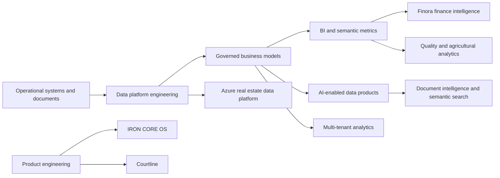

<div align="center">
  

  # Hamza Bakh

  **Data Engineer · Analytics Engineer · BI & AI Systems**

  I build governed data platforms and decision-ready products—from ingestion and modeling to executive analytics.

  [](https://www.linkedin.com/in/hamza-bakh/)
  [](https://github.com/Hamzabakh1?tab=repositories)
  
</div>

## Profile

My work connects operational systems to reliable analytics:

```text
Source systems → ingestion → governed models → semantic metrics → BI / AI products → decisions
```

I focus on traceable business logic, tested transformations, practical automation, and clear communication between technical and business teams.

## Selected repositories

| Project | Focus | Maturity |
|---|---|---|
| [Azure Real Estate Data Platform](https://github.com/Hamzabakh1/azure-real-estate-data-platform) | Azure Data Factory orchestration, Bronze/Silver/Gold contracts, quality gates, Azure SQL marts, and Power BI analytics | End-to-end cloud data engineering project |
| [Multi-Tenant Data Warehouse](https://github.com/Hamzabakh1/multi-tenant-data-warehouse-saas-bi) | Tenant-isolated ingestion, warehouse modeling, and embedded BI | Data architecture case study |
| [ETL + Metabase PFE](https://github.com/Hamzabakh1/PRJ_ETL_METABASE_PFE1) | Python ETL pipelines and analytics delivery | Implemented project |
| [Automated Validation Framework](https://github.com/Hamzabakh1/python-automated-validation-framework) | Reusable Python validation and data-quality checks | Implemented framework |
| [Finora Financial Intelligence](https://github.com/Hamzabakh1/finora-financial-intelligence) | Adaptive finance platform, regional policy packs, and executive analytics | Architecture blueprint |
| [IRON CORE OS](https://github.com/Hamzabakh1/iron-core-os) | Local-first execution system with linked records, KPIs, and live updates | Working local prototype |
| [Courtline](https://github.com/Hamzabakh1/courtline-padel-community) | Mobile-first padel matchmaking and community experience | Interactive front-end prototype |

## Architecture portfolio




## Core capabilities

| Area | Tools and methods |
|---|---|
| Data engineering | Python, SQL, ETL/ELT, Prefect, Airflow, APIs, Docker |
| Analytics engineering | dbt-style modeling, dimensional design, tests, documentation, semantic layers |
| Warehousing | Snowflake, SQL Server, PostgreSQL, MySQL |
| BI and finance analytics | Power BI, Metabase, DAX, Power Query, KPI design, budget vs actual |
| AI and automation | OCR, Tesseract, embeddings, RAG patterns, FastAPI, scikit-learn |
| Product systems | React, TypeScript, Next.js, local-first architecture, interactive prototypes |

## Engineering principles

- Define source contracts and metric ownership before dashboard design.
- Keep raw, cleaned, core, and consumption layers explicit.
- Make quality checks, lineage, and reconciliation part of the delivery path.
- Separate deterministic calculations from AI-generated explanations.
- Design every system around a real business decision and measurable outcome.

## Current focus

- Production-grade portfolio projects in data engineering and analytics engineering.
- Advanced SQL, orchestration, Snowflake, semantic modeling, and data quality.
- Finance, agricultural operations, embedded BI, and AI-ready data products.

## Contact

- [LinkedIn](https://www.linkedin.com/in/hamza-bakh/)
- [GitHub](https://github.com/Hamzabakh1)
- Agadir, Morocco · Open to remote, hybrid, relocation, and international opportunities

<div align="center">
  <strong>Reliable data. Clear decisions. Measurable impact.</strong>
</div>
